---
lab:
    title: 'Lab 6 – Automate Resources'
    module: 'Automation of Tasks'
---

# Lab 6 – Automate Resources

 

**Estimated Time**: 60 minutes

This lab can be performed from a web browser with access to the Azure portal.

Note: the Microsoft.Insights module needs to be added to your subscription in order to complete this lab. You can register by completing the following steps. 

From the Azure portal, click on the cloud shell icon on the top right of the portal.


A shell will open at the bottom of the screen. Click on PowerShell as shown below.


You may be prompted to create a storage account. Click Create Storage. 


After the PowerShell window opens, paste in the following command: 

```sql
register-AzResourceProvider -ProviderNamespace Microsoft.Insights
``` 


 

**Lab files**: The files for this lab are in the D:\LabFiles\Automate Resources folder.

# Lab overview

The students will take the information gained in the lessons to configure and subsequently implement automate processes within AdventureWorks. 

# Lab objectives

After completing this lab, you will be able to:

1. Deploy an Azure resource from a GitHub Quickstart template

2. Schedule maintenance jobs and configure notifications

3. Configure multi-server automation

4. Configure performance metric related notifications

5. Configure notifications based on resources

6. Deploy an Azure Automation Runbook to perform index maintenance in an Azure SQL Database

# Scenario

You have been hired as a Senior Data Engineer to help automate day to day operations of database administration. This automation is to help ensure that the databases for AdventureWorks continue to operate at peak performance as well as provide methods for alerting based on certain criteria. AdventureWorks utilizes SQL Server in both Infrastructure as a Service and Platform as a Service offerings. 

 

# Exercise 1: Deploy an Azure Quickstart Template 

Estimated Time: 30 minutes

Individual Exercise

The main task for this exercise is as follows:

1. Deploy an Azure resource from a GitHub Quickstart template

2. Configure performance metric related notifications

3. Deploy an Azure Automation Runbook to perform index maintenance in an Azure SQL Database

## Task 1: Deploy an Azure SQL Database

1. Navigate to the following GitHub using a web browser. 

    [https://github.com/Azure/azure-quickstart-templates/tree/master/201-sql-database-transparent-encryption-create](https://github.com/Azure/azure-quickstart-templates/tree/master/201-sql-database-transparent-encryption-create)

 
    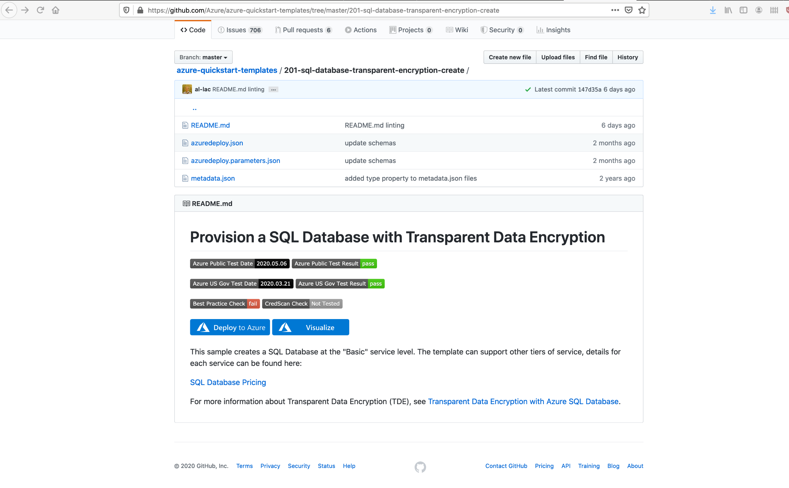

    Click on azuredeploy.json, and review the file. 


2. Navigate back the above link, and click on the Deploy to Azure button. You may be prompted to login to the Azure portal. Login with your supplied credentials.


3. You will see the following screen. In order to deploy this template, you need to complete the blank fields.


     

    In the Resource Group field, click “Create New” and type DP300-Lab06. In the SQL Administrator login field, type **labadmin**. For the password field, type the password **Azur3Pa$$**. Click on the check box next to “I agree to the terms and conditions” and then click purchase. 


4. After you click Purchase. Your deployment will begin. You can track the status of your deployment by clicking the bell (highlighted in the screenshot below) and then clicking on the Deployment in progress link in the Notifications pane.

    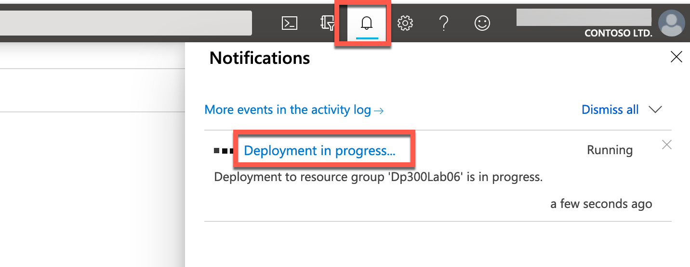


    Your deployment will take approximately 5-10 minutes to deploy. If you have clicked on the link above, you will be able to track your deployment. 

    

5. Upon completion, the screen will update with a link to your newly created resources. 

    


    Click on the Go to resource link. You will be taken to the Azure Resource Group your deployment just created. Make note of the name of your SQL server, as you will use it in the next exercise.

    

 

# Exercise 2: Configure Performance Metrics Based Alerts

Estimated Time: 30 minutes

Individual Exercise

The main task for this exercise is as follows:

1. Configure performance metric related notifications

## Task 1: Creating an alert when CPU exceeds an average of 80 percent.

1. Navigate back to portal.azure.com. You may need to login again. In the search bar at the top of the Azure Portal, type SQL, and click on SQL databases. Click on the database name.

    


2. On the main blade for the sample-db-with-tde database, navigate down to the monitoring section 

3. Click on Alerts

    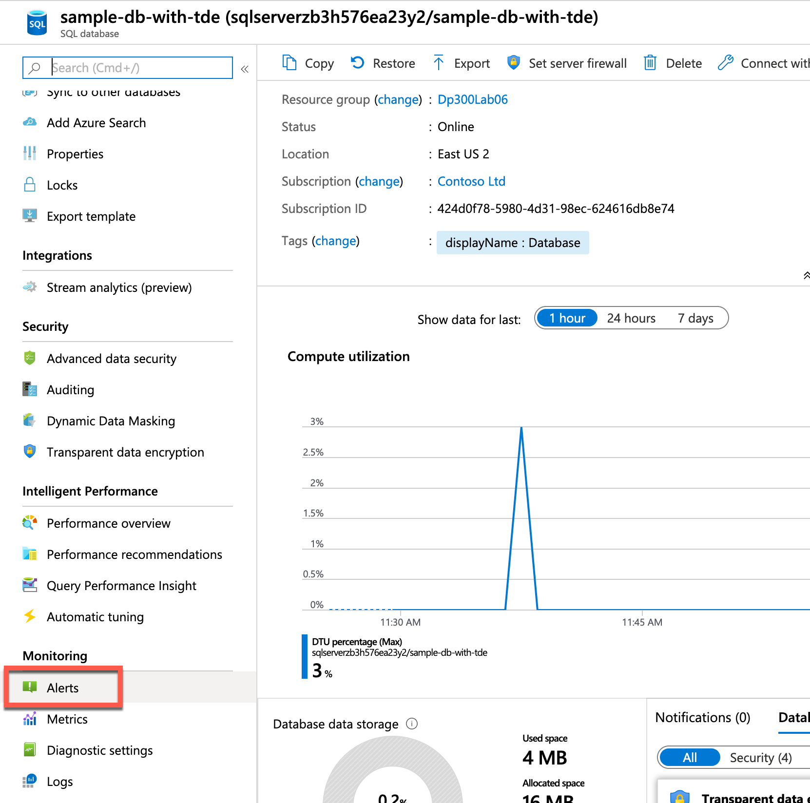


4.  Click on New Alert Rule.

    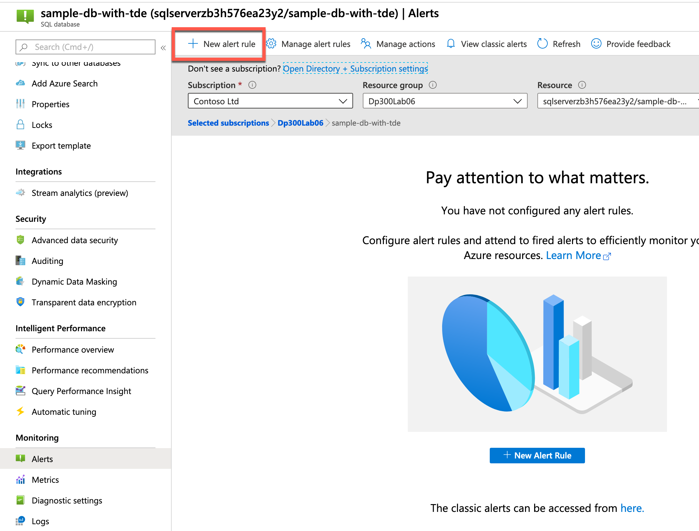

 

5. You will notice that the resource is already populated for you with the SQL Server you created. Under the Condition section, click Select Condition.

    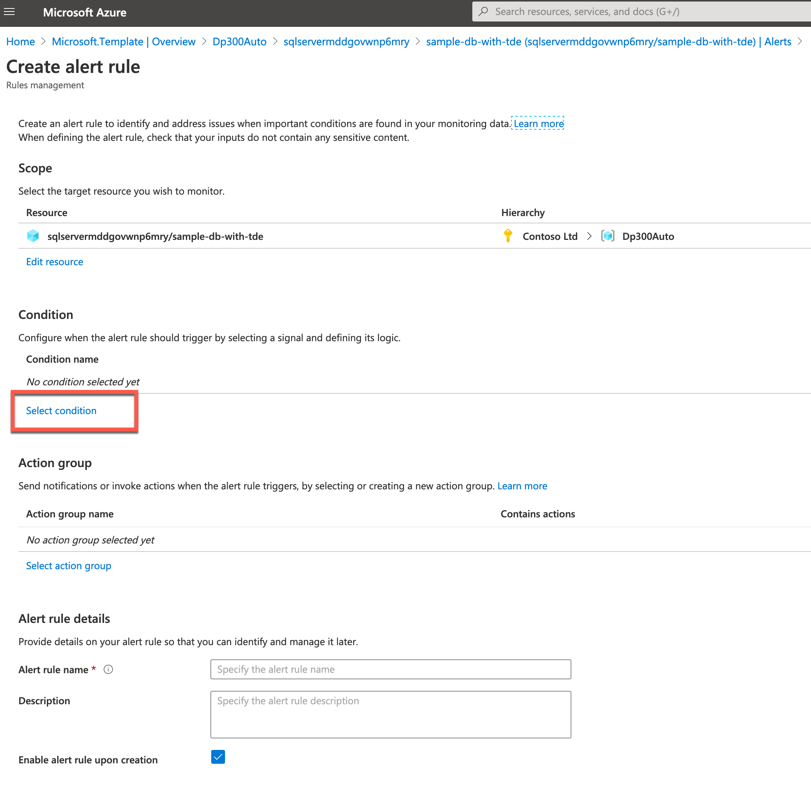

6. In the Configure signal logic slide out menu, select CPU Percentage. 

    


7. Supply a threshold value of 80. Click Done.

    

8. Under Action Group (optional) section, click Select Action Group 

    

9. In the fly out for Action group, Click Create action group.


    

    In the Create action group screen, type emailgroup in the Action group name field.


    

 
10. Then click on the notifications tab.

    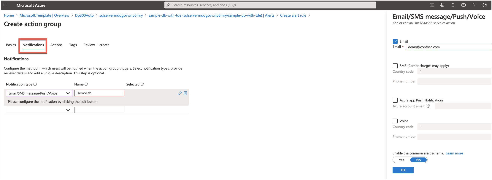


11. Select Email/SMS message/Push/Voice and enter the name DemoLab. In the flyout screen on the right (shown in the image above), click the check box next to email, enter an email address and click OK. Then click on the Review and Create button, and then click Create on the Create Action group screen.


    From the Create alert rule screen, add an Alert rule with the name DemoAlert, and then click Create alert rule as show below.
 

    

 


# Exercise 3: Deploy an Automation Runbook


Estimated Time: 30 minutes

Individual Exercise

The main task for this exercise is as follows:

1. Deploy a maintenance task script.

2. Deploy an Azure Automation Runbook to perform index maintenance in an Azure SQL Database

## Task 1:Deploy an Automation Runbook to rebuild indexes in an Azure SQL Database.

1. From the lab virtual machine, start a browser session and navigate to [https://portal.azure.com](https://portal.azure.com/). Provide appropriate credentials. 

    

2. In the Azure Portal in the search bar type Automation and then click on Automation Accounts

    

    Click on the + Add button in the portal.
 
    

3. Create your automation account

    


    Name: **DP3006Lab06**

    Resource Group: Use the resource group you created earlier in this lab. **DP300-Lab06**

    Location: Use the region in which you created your Azure SQL server in Lab 2

    Click Create. Your automation account should deploy in 1-3 minutes. 


4. Navigate to the **github** page for AdaptativeIndexDefragmentation. [https://github.com/microsoft/tigertoolbox/blob/master/AdaptiveIndexDefrag/usp_AdaptiveIndexDefrag.sql](https://github.com/microsoft/tigertoolbox/blob/master/AdaptiveIndexDefrag/usp_AdaptiveIndexDefrag.sql)

    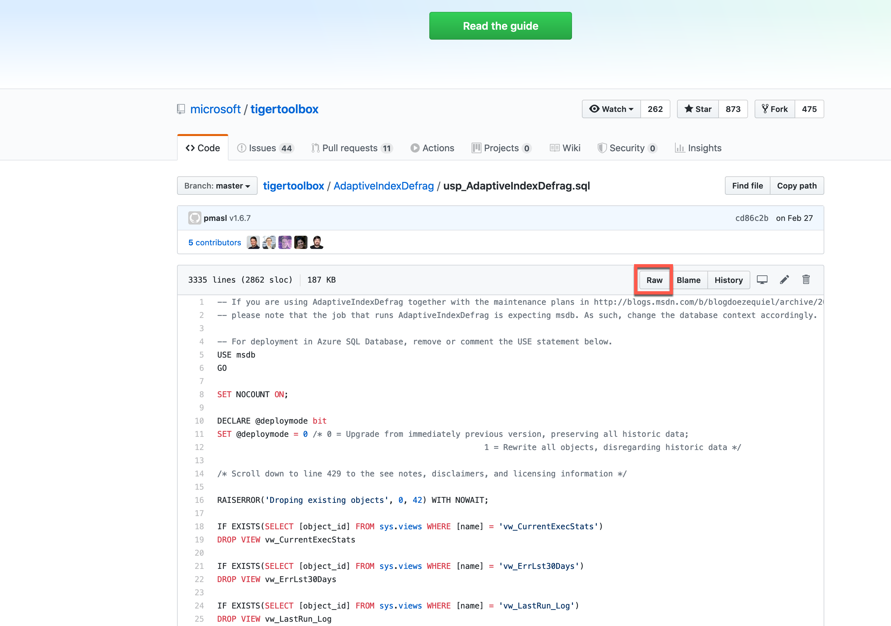

 
    Click on Raw. This will provide the code in a format where you can copy it. Select all of the text and copy it to your clipboard. 


5. In the Azure Portal, navigate back to your database and click on the Query Editor as shown below.

    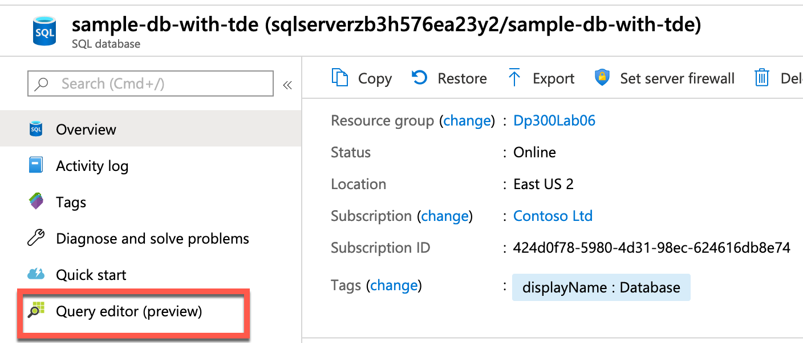

6. You will be prompted for credentials to login to your database. Use the credentials you created in Exercise 1.
   Login: labadmin
   Password: Azur3Pa$$

    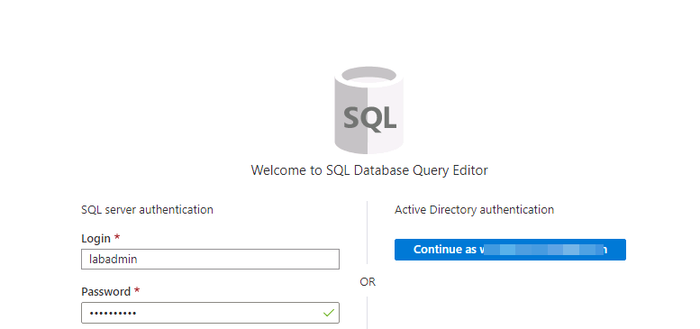


    You may receive an error that a firewall rule needs to be created as shown below.

    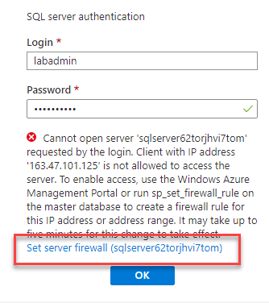

    Click on the blue Set server firewall link at the end of the error message as shown above. The server firewall screen will come up. Click Add client IP as highlighted below.


    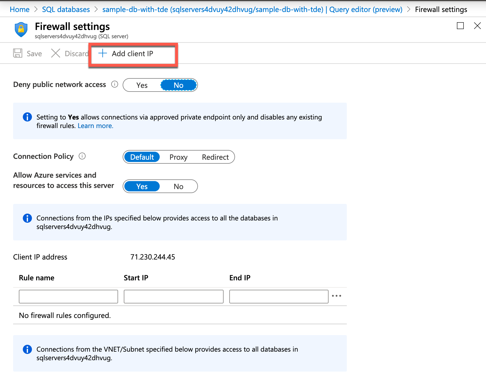

    Click the Save button to save the firewall configuration

    

    After you see the success message above, click on the link to Query editor (outlined in red in the above image) above the firewall settings pane. 


    When you return to the query editor, click Ok, to login to your database. Paste the text you copied earlier in this task into the Query 1 pane. 

    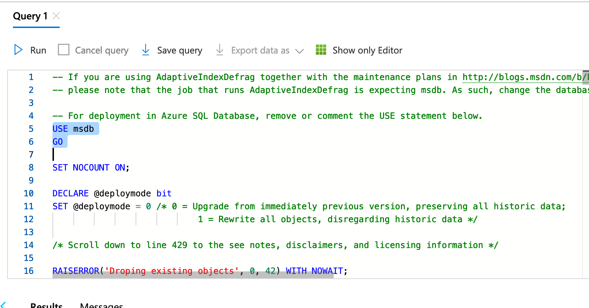


    Delete the USE msdb and GO statements on lines 5 and 6 of the query (that are highlighted in the above screenshot) and then click run. 

    


    The query may take a few seconds to complete. 


7. In the Azure portal, expand the left menu and click on All Services within the main Azure panel. 

    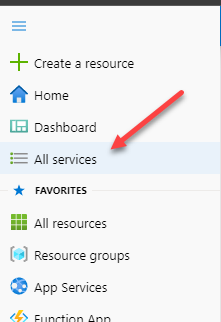

8. Type automation within the search field. Click on Automation Accounts. 

    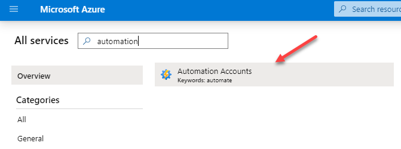


    Identity the automation account that has been created in your subscription and click on it.


    

9. Select Modules from the Shared Resources section of the Automation blade. 

    

10. Click on Browse Gallery

    


11. Search for sqlserver within the Gallery

    


12. Click on the SqlServer text which will direct to the next screen. Click on Import
    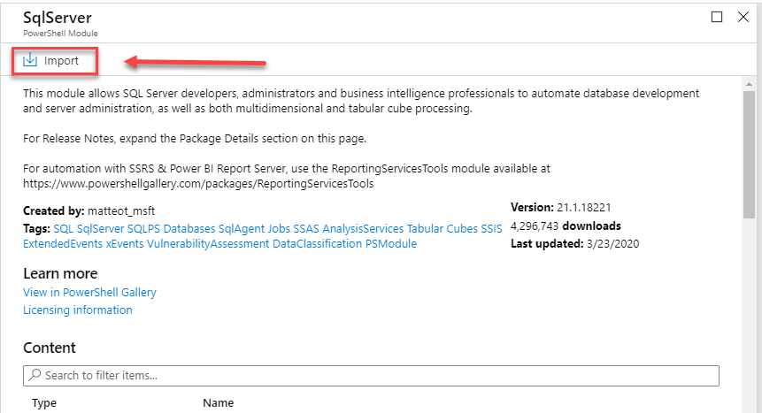

13.  Click on Ok in the bottom corner of the screen in order to import the module. This will import the PowerShell module into your Automation account.
    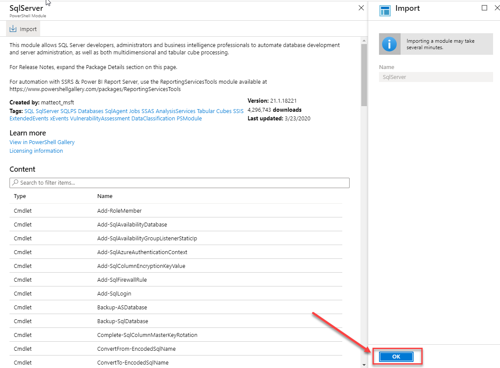


14. You will need to create a credential to securely login to your database. From the Automation Account blade navigate to the Shared Resources Section and click Credentials.

    


    Click + Add a credential, and then create a credential as shown below. Name the credential SQLUser and use the labadmin username and Azur3Pa$$ for the password. Click Create.

    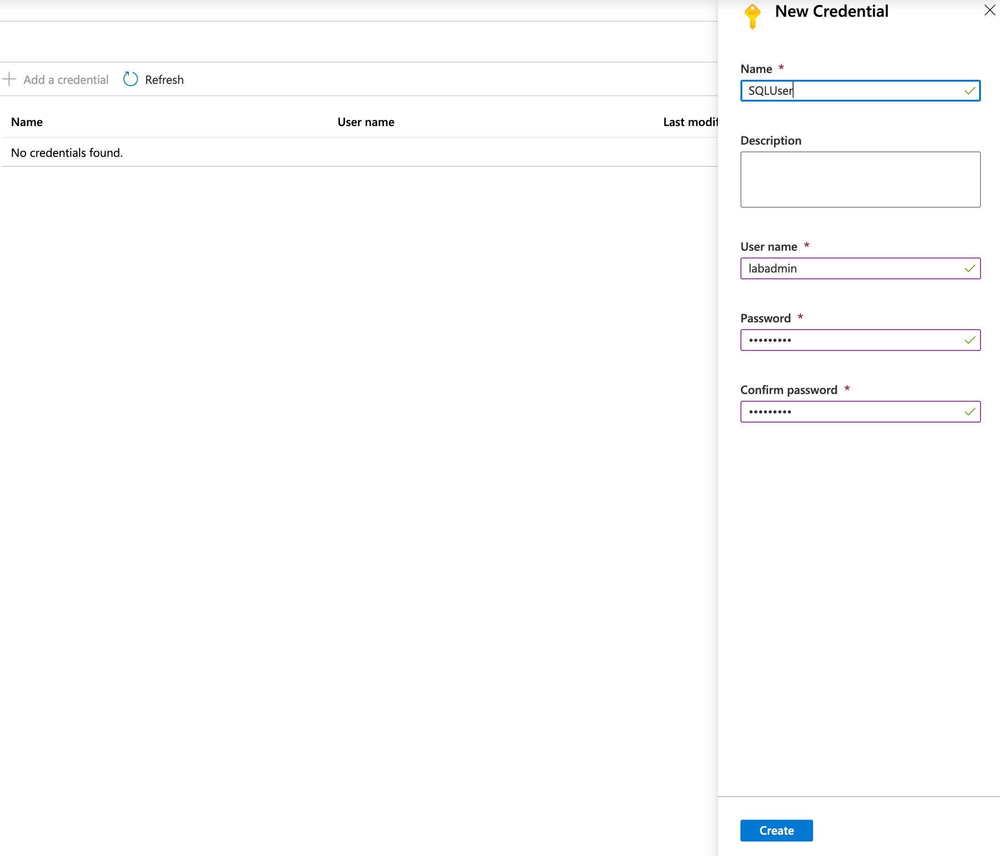


15. Scroll to the Process Automation section of the Automation account blade and click on Runbooks and then Create a runbook.

    

16. Supply a runbook name of IndexMaintenance and a runbook type of Powershell. You can supply a short description of your choosing. Click Create once finished. 

    

    Once the runbook has been created, the process should drop you directly into the runbook.   
‎

17. Use Windows Explore to navigate to the folder D:\LabFIles\Automate Resources. Right click on the DP300-Lab-Module-6.ps1 file, and click Edit. The PowerShell IDE will open.

    
    
    Edit the $AzureSQLServerName variable to reflect the name of your Azure SQL server. You can get this value from the overview screen of your Azure SQL Database as shown below.

    


    Copy the name of the server including the .database.windows.net domain suffix. 


    


    On Line 1 of the file paste in your server name. Select all of the text and copy it to your clipboard. 


18. Navigate back to your automation runbook, and paste in the PowerShell code you copied from the PowerShell IDE. Then click Save and then click Publish

    


19. Click Yes if prompted to over-write any previously published versions. 

    

20. Next you will schedule the runbook to execute on a regular basis. Click on Schedules in the left hand navigation menu. Then click on Add a schedule at the top. 

    

21. Click on Link a schedule to your runbook. 

22. Select Create a new schedule. 

    

23. Supply a descriptive schedule name and a description if desired. 

24. Specify the start time of 4:00AM of the following day and in the Eastern Time zone. Configure the reoccurrence for every 1 days. Do not set an expiration. 

    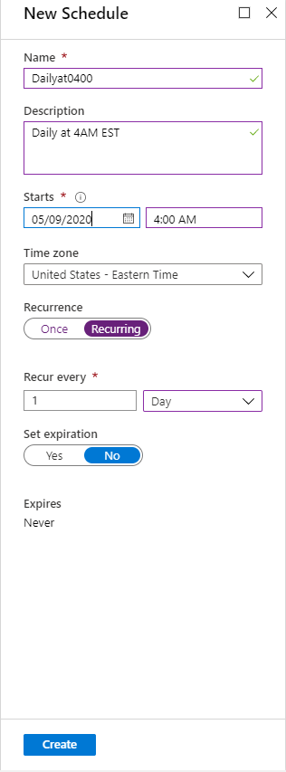

25.  Click **Create**. 

26. The schedule is now linked to the runbook. 

    

 

 

 

 

 
