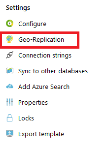
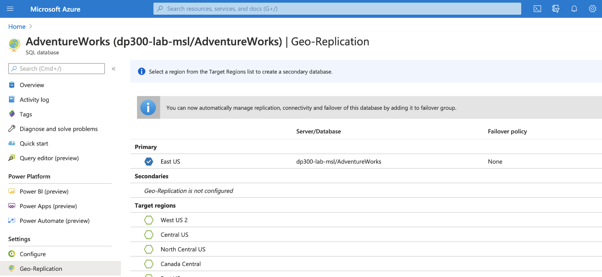
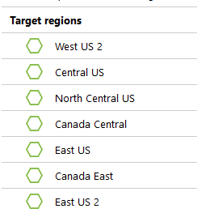
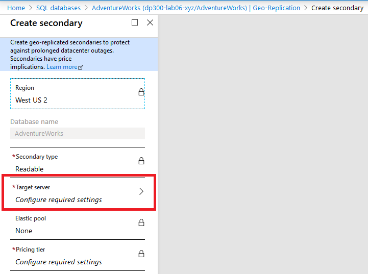
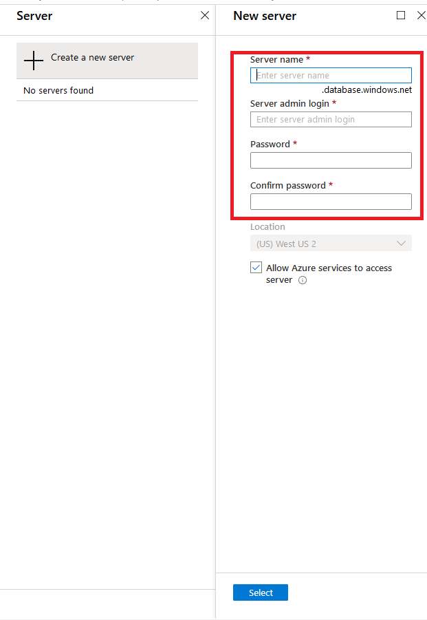
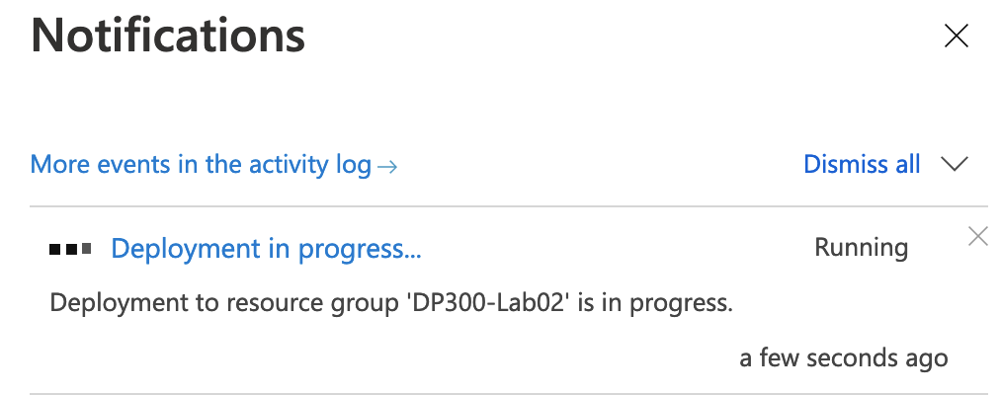
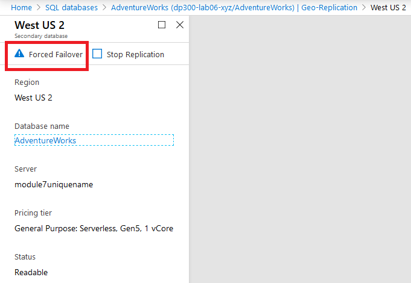
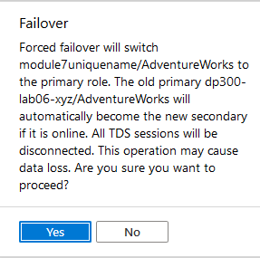

---
lab:
    title: 'Lab 7 – Planning and Implementing a High Availability and Disaster Recovery Environment'
    module: 'Planning and Implementing a High Availability and Disaster Recovery Environment'
---

# Lab 7 – Planning and Implementing a High Availability and Disaster Recovery Environment

**Estimated Time**: 60 – 90 minutes

**Pre-requisites**: The Azure SQL Database used by Exercise 1 was created in the lab for Module 3. 

**Lab files**: The files for this lab are located in the D:\Labfiles\High Availability folder.

# Lab overview

The students will execute two main tasks: make Azure SQL Database geo-redundant, and backup to and restore from a URL which uses Azure. 

# Lab objectives

After completing this lab, you will be able to:

1. Enable geo-replication for Azure SQL Database

	- Configure geo-replication

	- Perform a failover between regions

2. Backup and restore a SQL Server database using a URL

	- Create a shared access signature (SAS)

	- Configure backup to URL

	- Backup a database to URL

	- Restore a database from URL

# Scenario

Now that you have automated day-to-day tasks in the previous lab, as the Senior Data Engineer, you are tasked with improving the availability of both IaaS and PaaS configurations for your database environment. You are tasked with the following objectives:

1. Enable geo-replication for Azure SQL Database to increase availability for a database.

2. Back up a database to a URL in Azure and restore it after a human error has occurred.


# Exercise 1: Enable Geo-Replication for Azure SQL Database

Overview

The Students will alter the configuration of the Azure SQL Database created during the lab for Module 3 to make it highly available.

Lab Objectives

The students will be able to: 

- Enable geo-replication for Azure SQL DB using the portal

- Test the geo-replication including failover

Scenario

As a DBA within WideWorldImporters you need to know how to enable geo-replication for Azure SQL Database, ensure it is working, and know how to manually fail it over to another region using the portal.

Pre-requisites

- Azure account created for the student – must provide a login (e-mail) and password

- Azure SQL Database server and database pre-created

 

1. If you are not logged into the Azure portal via a browser window, do so using the Azure credentials provided to you.

2. From the menu, select SQL databases as shown below.

	

3. Click on the Azure SQL Database that was created in Lab 3. An example is shown below.

	

 

4. In the blade for the database, select Geo-Replication. 

	

	The region where the database is currently configured is shown in a blue hexagon with a white checkmark in a table as shown below. You will see that geo-replication is not configured.

	

5. At the bottom of the blade, select a Target Region. All available regions will have a hexagon with a green outline.

	

6. In this example, West US 2 was selected as can be seen on the Create secondary blade. Select Target server.

	

7. On the New server blade, enter a name of module7geo<unqiueguid>,, a valid admin login, and a secure password. Click Select when done.

	

8. Click **OK** on the Create secondary blade. The secondary server and the database will now be created. To check the status, look under the bell icon at the top of the portal. If successful, it will progress from Deployment in progress to Deployment succeeded. 

	


	You will also notice that in the status column of the table, the status will go from Initializing, to a seeding percentage complete as shown below to Readable when the replication in syncrhonized

	

9. Now that the Azure SQL Database is configured with geo-replication, you will perform a failover. Select your secondary server (West US2 as shown in the previous picture but you may have chosen a different region).

10. On the blade, click Forced Failover.

	

11. When prompted, click Yes. 

	


	The status of the primary replica will switch to Pending and the secondary, Failover. The process will take a few minutes. When complete, the roles will switch with the secondary becoming the new primary and the old primary the secondary.

	


# Exercise 2: Backup to URL and Restore from URL

Estimated Time: 15 - 30 minutes

The tasks for this exercise are as follows:

1. Configure backup to URL

2. Back up WideWorldImporters

3. Restore WideWorldImporters

## Task 1: Configure Backup to URL

Before backing up a database in SQL Server to Azure, there are some configuration tasks to perform..

1. Switch to the Remote Desktop session for LON-SQL1.

2. Start Edge.

3. Log into the Azure portal ([https://portal.azure.com](https://portal.azure.com/)) using the credentials provided if you are not already. 

4. Open a Cloud Shell prompt by selecting the icon shown below in the upper right corner.

	

5. At the bottom half of the portal, you may see a message welcoming you to Azure Cloud Shell, if you have not yet used Cloud Shell. Select Bash.

	

6. If you have not previously used Cloud Shell, you must give it storage. Click Create Storage in the dialog below.

	


7. If you have already used Cloud Shell, just make sure the upper level corner of the Cloud shell screen show Bash. You can use the drop down arrow to select either PowerShell or Bash. 
 

	Once complete, you will see a prompt similar to the one below.

	


8. Create a storage account from the CLI using by executing the following command in cloud shell.

	```
	az storage account create -n dp300storage -g DP-300-Lab02 --kind StorageV2 -l eastus2
	```

	Your storage account name must be unique and all lower case with no special characters. You should change dp300storage in the above to a unique name like dp300storagemsl123. The value dp300lab06 is the name of a Resource Group. Make sure you use one that has been created in an earlier lab.


	Next you will get the account keys for your account, which you will use in subsequent steps. Execute the following code in cloud shell:


	az storage account keys list -g DP-300-Lab02 -n dp300storage


	Your account key will be in the results of the above command. Make sure you use the same name (after the -n) and resource group (after the -g) that you used in the previous command. Copy the returned value for key1 (without the double quotes) as shown here.


	
 

9. Backing up a database in SQL Server to a URL uses a storage account and a container within it. You will create a container specifically for backup storage in this step. To do this, execute

	```
	az storage container create --name "backups" --account-name "dp300storage" --account-key "storage_key" --fail-on-exist
	```
 
	where dp300storage is the storage account name used when creating the storage account and storage_key is the key generated above. The output should return true.

	


10. To further verify the container backups has been created, execute 

	```
	az storage container list --account-name "dp300storage" --account-key "storage_key"
	```

	where dp300storage is the storage account name used you created and storage_key is the key you generated above. Part of the output should return something similar to below.

	


11. A shared access signature (SAS) at the container level is required for security. This can be done via Cloud Shell or PowerShell, Execute the following:

	```
	az storage container generate-sas -n "backups" --account-name "dp300storage" --account-key "storage_key" --permissions "rwdl" --expiry "date_in_the_future" -o tsv
	```
	

	where dp300storage is the storage account name you created above, storage_key is the key generated above, and date_in_the_future is a time later than now. date_in_the_future must be in UTC. An example is 2020-05-31T00:00Z which translates to expiring at May 31, 2020 at midnight. 


	The output should return something similar to below which will be used in the next Task.

	


## Task 2: Back Up WideWorldImporters

Now that the functionality is configured, you can generate a backup file as a blob in Azure. 

1. Switch to SSMS and ensure you are connected to LON-SQL1.

2. Click New Query.

3. Create the credential that will be used to access storage in the cloud with the following Transact-SQL. Fill in the appropriate values.
	```sql
	IF NOT EXISTS 

	(SELECT * FROM sys.credentials 

	WHERE name = 'https://dp300storage.blob.core.windows.net/backups') 

	BEGIN

	CREATE CREDENTIAL [https://dp300storage.blob.core.windows.net/backups]

	WITH IDENTITY = 'SHARED ACCESS SIGNATURE',

	SECRET = 'sas_token'

	END;

	GO 
	```
	where dp300storage is the storage account name created in Task 1 and sas_token is the value generated in Step 9. 

4. Click Execute. This should be successful.

5. Back up the database WideWorldImporters to Azure with the following command in Transact-SQL:
	```sql
	BACKUP DATABASE WideWorldImporters 

	TO URL = 'https://dp300storage.blob.core.windows.net/backups/WideWorldImporters.bak';

	GO 
	```
	where dp300storage is the storage account name used in Task 1.

	If successful, you should see output similar to this:

	Processed 1240 pages for database 'WideWorldImporters', file 'WWI_Primary' on file 1.

	Processed 53104 pages for database 'WideWorldImporters', file 'WWI_UserData' on file 1.

	Processed 3865 pages for database 'WideWorldImporters', file 'WWI_InMemory_Data_1' on file 1.

	Processed 1468 pages for database 'WideWorldImporters', file 'WWI_Log' on file 1.

	BACKUP DATABASE successfully processed 59677 pages in 14.839 seconds (31.419 MB/sec).

	Completion time: 2020-05-18T08:01:41.6935863+00:00

	

	If something is configured wrong, you will see an error message similar to the following:

	Msg 3201, Level 16, State 1, Line 33  
	‎Cannot open backup device 'https://dp300storage.blob.core.windows.net/container_name/WideWorldImporters.bak'. Operating system error 50(The request is not supported.).  
	‎Msg 3013, Level 16, State 1, Line 33  
	‎BACKUP DATABASE is terminating abnormally.


	Check that you did not mistype anything and that everything was created successfully.

6. To see that the file is actually in Azure, you can use Storage Explorer or Azure Cloud Shell. The syntax in Bash is 
	```
	az storage blob list -c "backups" --account-name "dp300storage" --account-key "storage_key"
	```
	
	where dp300storage is the storage account name used in Task 1, storage_key is the key used there as well. Sample output is shown below.

	

 
## Task 3: Restore WideWorldImporters

This task will show you how to restore a database.


1. In a query window, execute 
	```sql
	USE WideWorldImporters;
	GO
	```

2. Now execute the statement below to return the very first row of the Customers table which has a CustomerID of 1. Note the name of the customer.
	```sql
	SELECT TOP 1 * FROM Sales.Customers;
	GO
	```
	
3. Run this command to change the name of that customer.
	```sql
	UPDATE Sales.Customers
	SET CustomerName = 'This is a human error'
	WHERE CustomerID = 1;
	GO
	```

4. Re-run Step 2 to verify that the name has been changed. Now imagine if someone had changed thousands or millions of rows without a WHERE clause – or the wrong WHERE clause.

5. To restore the database to get it back to where it was before the change you made in Step 3, execute
	```sql
	USE master;
	GO

	RESTORE DATABASE WideWorldImporters 
	FROM URL = 'https://dp300storage.blob.core.windows.net/backups/WideWorldImporters.bak';
	GO
	```

	where sp300storage is the storage account name used in Task 1.

	The output should be similar to this:

	Processed 1240 pages for database 'WideWorldImporters', file 'WWI_Primary' on file 1.

	Processed 53104 pages for database 'WideWorldImporters', file 'WWI_UserData' on file 1.

	Processed 1468 pages for database 'WideWorldImporters', file 'WWI_Log' on file 1.

	Processed 3865 pages for database 'WideWorldImporters', file 'WWI_InMemory_Data_1' on file 1.

	RESTORE DATABASE successfully processed 59677 pages in 16.167 seconds (28.838 MB/sec).

	Completion time: 2020-05-18T08:35:06.6344123+00:00

6. When the restore of WideWorldImporters is finished, re-run Steps 1 and 2. The data will be back to where it was.
